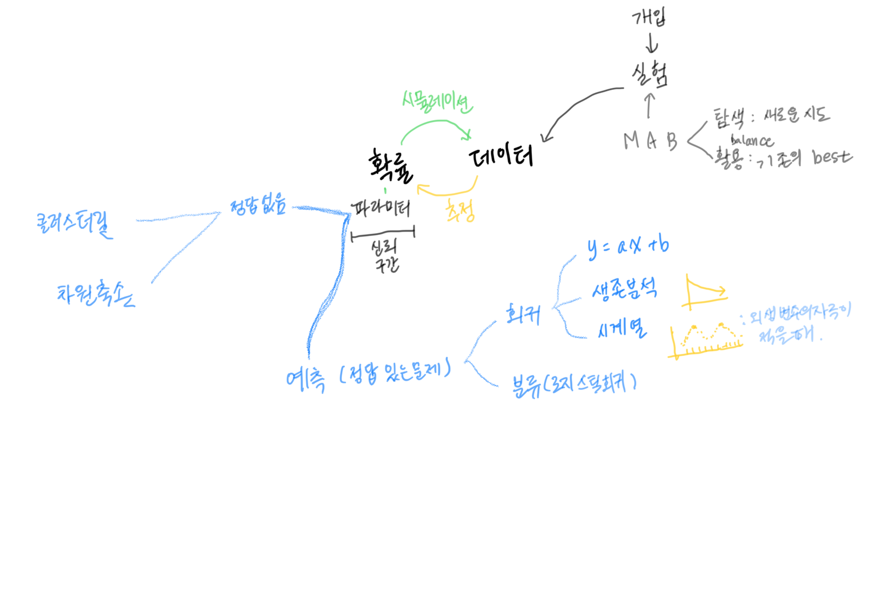

# 재명님 프로젝트 피드백 2019-11-13

# 결측값 처리

### Null 값에 의미가 있는 경우

09년부터 법이 제정되어 수집하기 시작한 경우, 09년 이전에는 모두 결측값

: 랜덤하게 비어있는 게 아니다 <주의할 것>

사망률이 높은 병원이 서울대병원

통계로는 나쁜 병원

: 심각한 환자가 제일 많이 가니까

Null 값이 있다면 병원에 불만족한 환자가 떠나서일수있다

: Null 값에 의미가 있다 

### 데이터가 무작위로 지워져있다면

Listwise Deletion

: 결측값이 있는 사례를 삭제

결측값 있는 사례가 매우 소수일 때

Imputation

: 결측값을 추측해서 채워넣는 것

널리 쓰이는 방법

비어있는 컬럼을 다른 컬럼으로 회귀분석 등을 통해 예측해서 채우는 방법

Imputation Packages [https://data-newbie.tistory.com/257](https://data-newbie.tistory.com/257)

모형 자체를 결측값이 있거나 없거나 상관없게 만드는 것: 잘 쓰지는 않는다, 어려워서

# Imbalanced Data

화재/비화재: 대부분이 비화재

뭐가 중요한지? 

아무거나 맞추면 되는지

화재를 맞추는게 중요한지

지표 정하기

우리 공모전은 f1 score

Imbalanced Data 를 다루는 전략

1. Undersampling

    Majority(비화재) 데이터를 없앤다

    👍 비율을 쉽게 맞출 수 있다

2. Oversampling

    Minority(화재) 데이터를 늘린다

    SMOTE (`Package`: `Imbalanced-Learn`  유명하다)

    데이터를 왜곡하기 쉽다

뭐가 좋을지 모르니까 다 해보고 지표상 좋은 걸 고른다

# Time Series

이전 시점의 일이 이후 시점에 영향을 준다

`시계열분석` `e.g.` 어제 갔으면 오늘 안 간다

`시계열분석이 안 맞는` `e.g.` 어제 많이 왔든 안왔든 오늘 어린이날이면 많이 온다 → 날씨 등 다른 변수 분석

시계열: 오늘의 주차대수 = **어제의 주차대수** + 요일 + 날씨

**어제의 주차대수**가 얼마나 영향력이 큰지가 시계열분석에서 중요한 Factor

Not 시계열, 회귀: 주차대수 = 요일 + 날씨 + 계절 + 공휴일

Not 시계열, Classification (e.g. 로지스틱 회귀): 주차가능? = 요일 + 날씨 + 계절 + 공휴일

# 이동평균

4개월 이동평균, 6개월 이동평균, 12개월 이동평균으로 그래프를 그려보는 이유

연속적으로 보기 위해서

# R-Squared

1 - MSE/VAR

MSE = (실제 - 예측)의 제곱의 평균

VAR = (실제 - 평균)의 제곱의 평균

